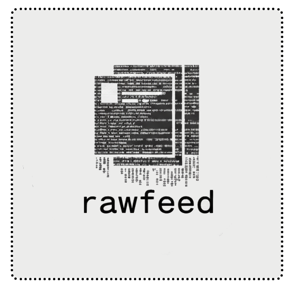

<p align="center">
  
  <br>
  <small>rawfeed — A raw <a href="https://11ty.dev" target="_blank">11ty</a> theme for minimalists</small>
</p>

## Requirements

| Required | Version | How to verify | How to install                    |
| -------- | ------- | ------------- | --------------------------------- |
| Git      | >= 2    | `git -v`      | [Git](http://git-scm.com/)        |
| NodeJs   | >= 20   | `node -v`     | [NodeJS](https://nodejs.org)      |
| Npm      | >= 9    | `npm -v`      | **NodeJS** contains **Npm**       |

## Clone

```shell
git clone https://github.com/rawfeed/rawfeed-11ty.git "my-site"; cd my-site; npm install
```

## Commands

**(1)** - Compile:

```shell
npm run build
```

**(2)** - Run server:

```shell
npm run serve
```

For more tasks, see: `npm run help`

# Changelog

See [here](https://rawfeed.github.io/rawfeed-11ty/changelog/)

# License

The theme is available as open source under the terms of [this License](https://rawfeed.github.io/rawfeed-11ty/license/).
